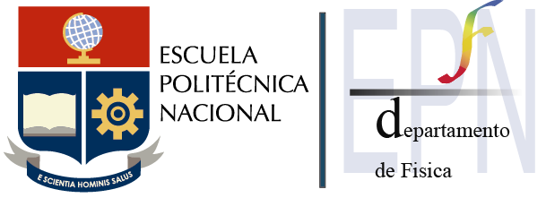

<!--
*** Thanks for checking out the Best-README-Template. If you have a suggestion
*** that would make this better, please fork the repo and create a pull request
*** or simply open an issue with the tag "enhancement".
*** Thanks again! Now go create something AMAZING! :D
-->


<!-- PROJECT SHIELDS -->
<!--
*** I'm using markdown "reference style" links for readability.
*** Reference links are enclosed in brackets [ ] instead of parentheses ( ).
*** See the bottom of this document for the declaration of the reference variables
*** for contributors-url, forks-url, etc. This is an optional, concise syntax you may use.
*** https://www.markdownguide.org/basic-syntax/#reference-style-links
-->


<!-- PROJECT LOGO -->
<br />
<p align="center">
  <a href="https://ciencias.epn.edu.ec/">
    
  </a>

  <h3 align="center">Visualización-Segmentación-Pulmonar-Archivos-DICOM</h3>

  <p align="center">
    El siguiente repositorio contiene una implementación de código en Python que permite la manipulación de archivos DICOM de TC para la visualización de las imágenes en diferentes planos anatómicos y segmentación de tejido pulmonar.
    <br />
    <!--<a href="https://github.com/othneildrew/Best-README-Template"><strong>Explore the docs »</strong></a>-->
    <br />
    .
    <a href="https://github.com/jennifer95/visualizacion-segmentacion-pulmonar-DICOM-python/blob/main/Visualizaci%C3%B3n%20de%20im%C3%A1genes%20DICOM.ipynb">Visualización DICOM</a>
    ·
    <a href="https://github.com/jennifer95/visualizacion-segmentacion-pulmonar-DICOM-python/tree/main/Herramienta%20DICOM%20VISUALIZER">Herramienta</a>
    .
    <a href="https://github.com/jennifer95/visualizacion-segmentacion-pulmonar-DICOM-python/blob/main/Segmentaci%C3%B3n%20de%20tejido%20pulmonar.ipynb">Segmentación Pulmonar</a>
  </p>
</p>


<!-- TABLE OF CONTENTS -->
<details open="open">
  <summary>Tabla de contenidos</summary>
  <ol>
    <li>
      <a href="#Acerca-del-Proyecto">Acerca del Proyecto</a>
      <ul>
        <li><a href="#Herramientas-usadas">Herramientas usadas</a></li>
      </ul>
    </li>
    <li>
      <a href="#Empezando">Empezando</a>
      <ul>
        <li><a href="#prerequisitos">Prerequisitos</a></li>
        <li><a href="#instalación">Instalación</a></li>
      </ul>
    </li>
    <li><a href="#Estructura-del-Proyecto">Estructura del Proyecto</a></li>
    <li><a href="#roadmap">Roadmap</a></li>
    <li><a href="#contributing">Contributing</a></li>
    <li><a href="#license">License</a></li>
    <li><a href="#contacto">Contacto</a></li>
    <li><a href="#Agradecimientos">Agradecimientos</a></li>
  </ol>
</details>


<!-- ABOUT THE PROJECT -->
## Acerca del Proyecto

<!--[![Product Name Screen Shot][product-screenshot]](https://example.com)-->


En el presente proyecto, se introducen dos metodologías esenciales que servirán como paso previo para la generación de futuros sistemas de Diagnóstico Asistido por Computadora (CAD) para la detección automática de numerosas enfermedades pulmonares.

* La primera metodología fue realizada con el objetivo de extraer información de archivos con formato DICOM mediante el uso de Python y el entorno de programación Jupyter Notebook. El proceso seguido hace posible la generación de imágenes en diferentes planos anatómicos, como es el plano coronal y el plano sagital, por medio de la matriz de píxeles, adicionalmente se desarrollo una herramienta (DICOM VISUALIZER) para anonimizar y visualizar la información e imágenes en archivos DICOM.
* La segunda herramienta presenta una técnica de segmentación de pulmones en imágenes de tomografía computarizada de tórax. La segmentación hace uso de la matriz de píxeles en unidades Hounsfield para identificar en un principio el tejido pulmonar mediante su grado de atenuación lineal de rayos X, luego se utiliza el algoritmo de Watershed basado en marcadores, siendo esta la base principal de la técnica, además se emplean diferentes operaciones morfológicas y transformaciones sobre los cortes axiales, obteniendo así la segmentación de pulmones.


### Herramientas usadas

Las herramientas usadas para este proyecto son:
* [Python](https://www.python.org/)
* [Jupyter Notebook](https://jupyter.org/)


<!-- GETTING STARTED -->
## Empezando

Para tener el ambiente adecuado para ejecutar el código sin errores se debe tener el software base descrito en prerequisitos y seguir los pasos que se muestran a continuación.

### Prerequisitos


* Python 3.X (Cualquier versión de Python 3)
* Pip 3 (Gestor de bibliotecas de Python 3)
* Jupyter Notebook (Cualquier versión)


### Instalación

1. Clonar el repositorio
   ```sh
   git clone https://github.com/jennifer95/visualizacion-segmentacion-pulmonar-DICOM-python.git
   ```
2. Instalación de librerías
   ```sh
   pip install -r requirements.txt
   ```


<!-- USAGE EXAMPLES -->
## Estructura del Proyecto

Use this space to show useful examples of how a project can be used. Additional screenshots, code examples and demos work well in this space. You may also link to more resources.

_For more examples, please refer to the [Documentation](https://example.com)_


<!-- ROADMAP -->
## Roadmap

See the [open issues](https://github.com/othneildrew/Best-README-Template/issues) for a list of proposed features (and known issues).


<!-- CONTRIBUTING -->
## Contributing

Contributions are what make the open source community such an amazing place to learn, inspire, and create. Any contributions you make are **greatly appreciated**.

1. Fork the Project
2. Create your Feature Branch (`git checkout -b feature/AmazingFeature`)
3. Commit your Changes (`git commit -m 'Add some AmazingFeature'`)
4. Push to the Branch (`git push origin feature/AmazingFeature`)
5. Open a Pull Request


<!-- LICENSE -->
## License

Distributed under the MIT License. See `LICENSE` for more information.


<!-- CONTACT -->
## Contacto

Jennifer Ortega - jennifer.ortega@epn.edu.ec

Project Link: [https://github.com/jennifer95/visualizacion-segmentacion-pulmonar-DICOM-python](https://github.com/jennifer95/visualizacion-segmentacion-pulmonar-DICOM-python)


<!-- ACKNOWLEDGEMENTS -->
## Agradecimientos
* [Guido Zuidhof, Full preprocessing tutorial](https://www.kaggle.com/gzuidhof/full-preprocessing-tutorial)
* [Ankasor, Improved lung segmentation using watershed](https://www.kaggle.com/ankasor/improved-lung-segmentation-using-watershed)

